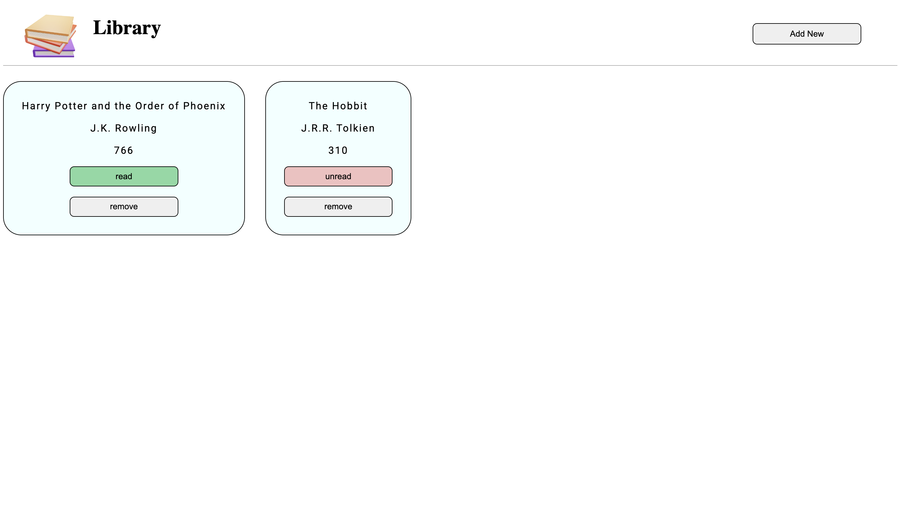
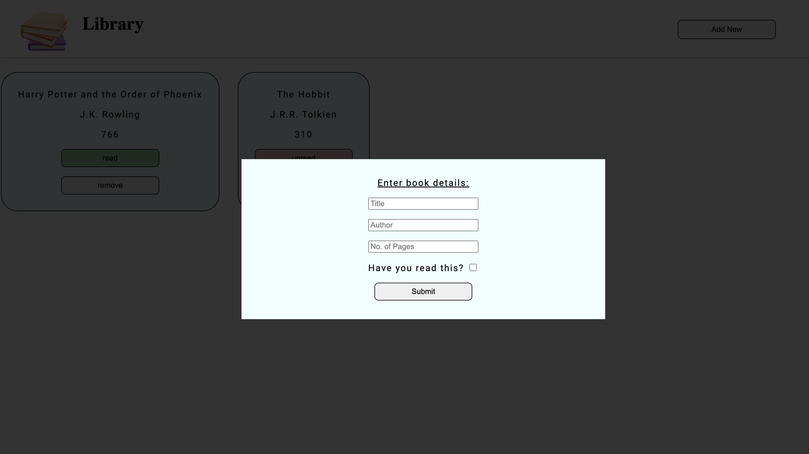
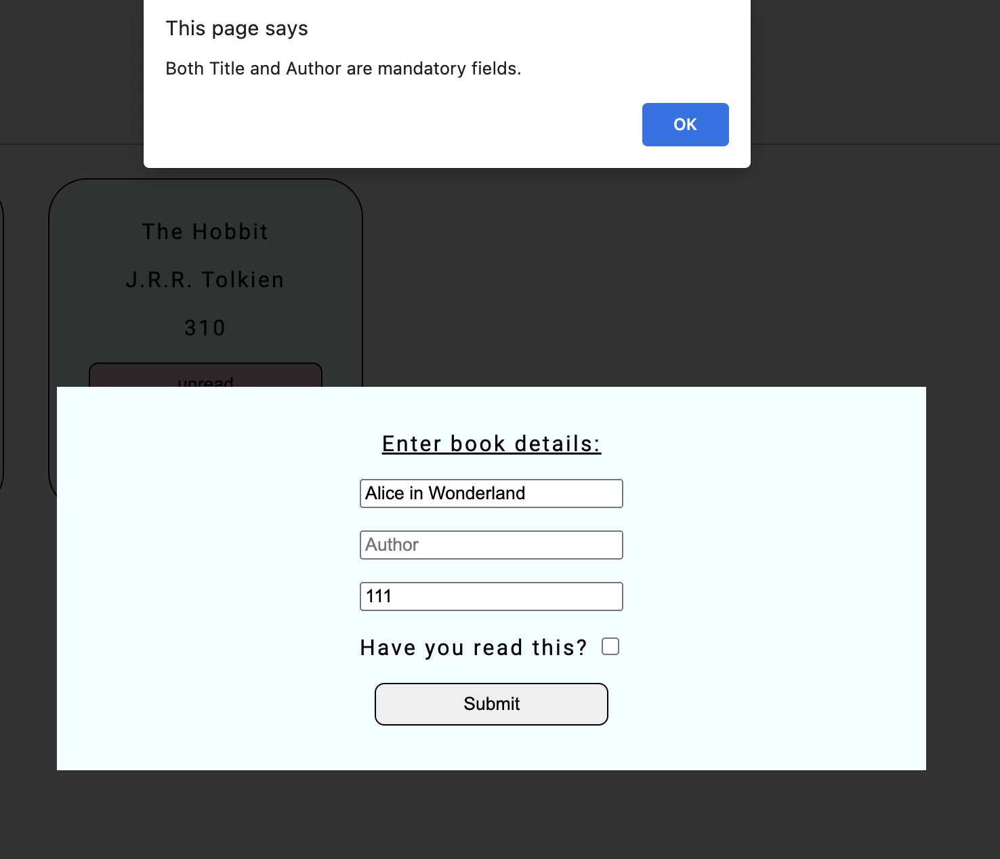
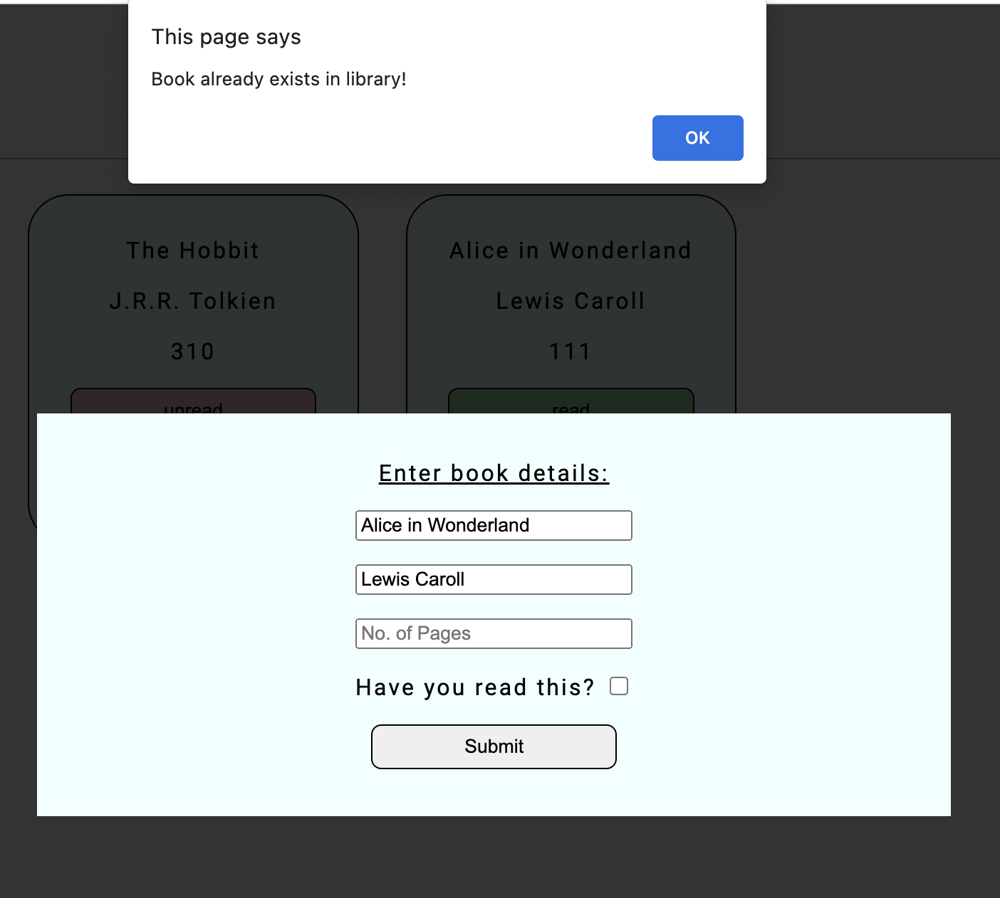
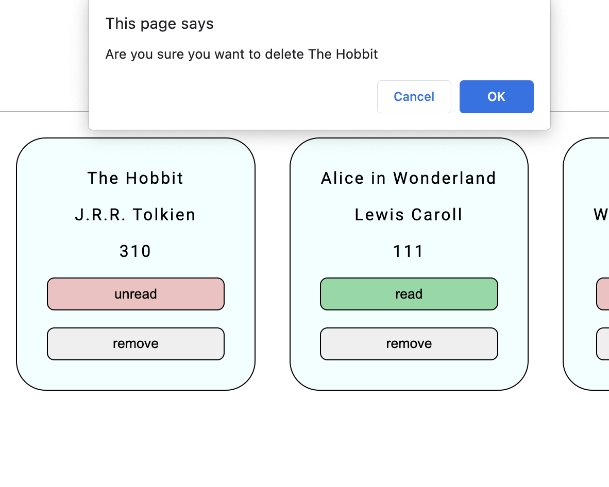
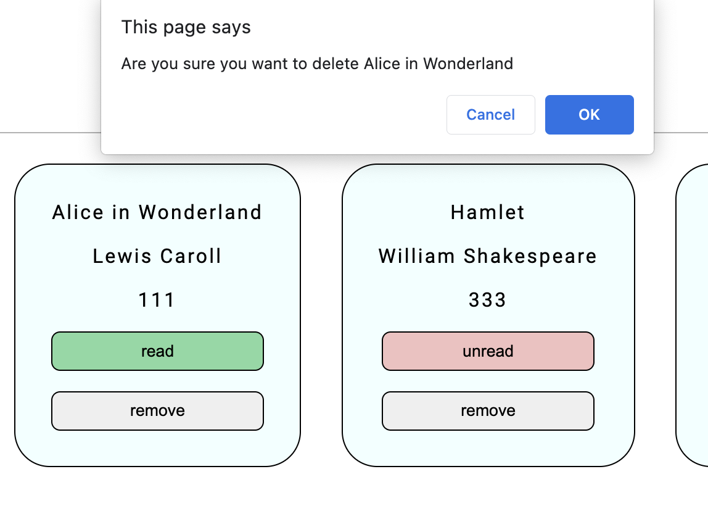
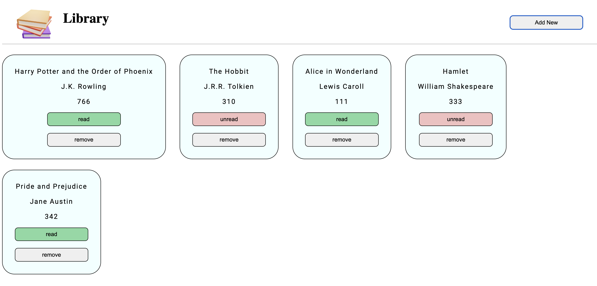
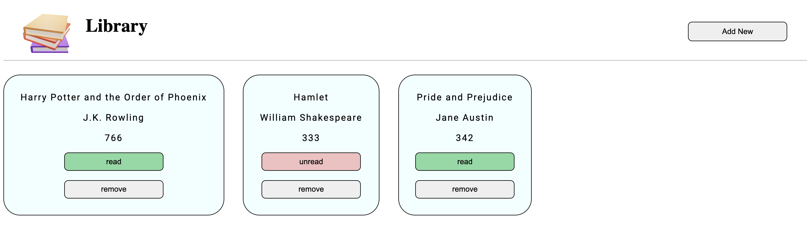

## Library
This project creates a library database to track the books a user owns in their library.
[](#table-of-contents)

## Overview:

<ul>
    <li>Library can add/remove books.</li>
    <li>Library includes two books by default.</li>
    <li>User can add a book through a form which opens in a modal</li>
    <li>There are various validations for the form fields</li>
    <li>User can track whether they have read or not read the book</li>
    <li>Information about the books in the library is displayed on the homepage in separate cards.</li>
</ul>

[](#table-of-contents)

## The below images show the Homepage and the Modal that appears when you click "Add New" button:



##



[](#table-of-contents)

## The below images show various validations for the Modal's form inputs:



##



##



##



[](#table-of-contents)

## The below images show successful deletion of books from the library:



##



[](#table-of-contents)

## Revised through this project:

<ul>
    <li>Modals and Overlays.</li>
    <li>JavaScript Object models & DOM manipulations through Objects.</li>
    <li>preventDefaults method(even though ended up not using it as I went with manual validations.)</li>
    <li>Event Listeners on parent containers and targetting nodes through DOM structure.</li>
</ul>

[](#table-of-contents)

```JS
addBookBtn.addEventListener("click", () => {
    myModal.classList.remove("hidden")
    overlay.classList.remove("hidden")
  })

bookDisplay.addEventListener("click", (e) => {
    if (e.target.textContent === "remove") {
      const titleToDelete = e.target.parentNode.firstChild.textContent
      if (confirm("Are you sure you want to delete " + titleToDelete)) {
        removeFromLibrary(titleToDelete)
        e.target.parentNode.classList.add("hidden")
      }
    }
})

```
